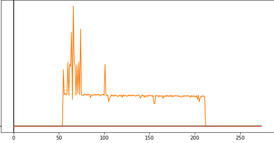

# Лабораторная работа №1

## Задание к лабораторной работе

``` 
Вариант:
A=123;B=0xCBE85519;C=mmap;D=75;E=164;F=nocache;G=21;H=random;I=148;J=min;K=cv
```
**Разработать программу на языке С, которая осуществляет следующие действия:**

Создает область памяти размером *A* `123` мегабайт, начинающихся с адреса *B* `0xCBE85519` (если возможно)
при помощи *C* = `mmap` заполненную случайными числами `/dev/urandom` в *D* `75` потоков.

Используя системные средства мониторинга определите адрес начала в адресном пространстве 
процесса и характеристики выделенных участков памяти.
Замеры *виртуальной/физической* памяти необходимо снять:

* До аллокации
* После аллокации
* После заполнения участка данными
* После деаллокации

Записывает область памяти в файлы одинакового размера *E* `164` мегабайт
с использованием *F* = `некешируемого` обращения к диску. Размер блока ввода-вывода *G* `21` байт.
Преподаватель выдает в качестве задания последовательность записи/чтения блоков *H* = `случайный`.

Генерацию данных и запись осуществлять в бесконечном цикле.

В отдельных *I* `148` потоках осуществлять чтение данных из файлов и подсчитывать агрегированные
характеристики данных - *J* = `минимальное значение`.

Чтение и запись данных в/из файла должна быть защищена примитивами
синхронизации *K* = `cv`.

По заданию преподавателя изменить приоритеты потоков и описать изменения в характеристиках программы. 

Для запуска программы возможно использовать операционную систему Windows 10 или 
Debian/Ubuntu в виртуальном окружении. (:peka MacOs) 

Измерить значения затраченного процессорного времени на выполнение программы 
и на операции ввода-вывода используя системные утилиты.

Отследить трассу системных вызовов. 

Используя `stap` построить графики системных характеристик.

## Выполнение

### Структура проекта

```
.
├── constants.h
├── file_ops.c
├── file_ops.h
├── main.c
├── Makefile
├── memory_ops.c
├── memory_ops.h
├── README.md
├── stap
│   └── stap_script.stp
├── util.c
└── util.h
```

### Код программы

* **constants.h**

```c
#ifndef OPERATING_SYSTEMS_ITMO_2020_CONSTANTS_H
#define OPERATING_SYSTEMS_ITMO_2020_CONSTANTS_H

#define A 123
#define B 0xCBE85519
#define C mmap
#define D 75
#define E 164
#define F nocache
#define G 21
#define H random
#define I 148
#define J min
#define K cv

#define megabyte 1024*1024

#endif //OPERATING_SYSTEMS_ITMO_2020_CONSTANTS_H
```

* **util.h**

```c
#ifndef OPERATING_SYSTEMS_ITMO_2020_UTIL_H
#define OPERATING_SYSTEMS_ITMO_2020_UTIL_H

#define INTERACTIVE

void wait_for_input(const char* msg);
long min(long a, long b);

#endif //OPERATING_SYSTEMS_ITMO_2020_UTIL_H
```

* **util.c**
  
```c
#include "util.h"
#include "stdio.h"

void wait_for_input(const char* msg) {
#ifdef INTERACTIVE
puts(msg);
getchar();
#endif
}

long min(long a, long b) {
return (a < b) ? a :  b;
}
```

* **memory_ops.h**
  
```c
#include <stddef.h>

#ifndef OPERATING_SYSTEMS_ITMO_2020_MEMORY_OPS_H
#define OPERATING_SYSTEMS_ITMO_2020_MEMORY_OPS_H

#define DEBUG

void* allocate_memory(void* addr, size_t size);
int deallocate_memory(void* addr, size_t size);
void fill_the_memory(void* addr, size_t size, const char* read_from, int thread_count);

#endif //OPERATING_SYSTEMS_ITMO_2020_MEMORY_OPS_H
```

* **memory_ops.c**
  
```c
#include <sys/mman.h>
#include <pthread.h>
#include <stdio.h>
#include <sys/types.h>
#include <fcntl.h>
#include <unistd.h>
#include <errno.h>
#include <stdlib.h>

#include "memory_ops.h"

struct to_fill_region {
    void *ptr;
    size_t size, offset;
    const char* read_from;
};

static void* filling_thread(void *arg);

void* allocate_memory(void* addr, size_t size) {
    return mmap(addr, size, PROT_READ|PROT_WRITE, MAP_SHARED|MAP_ANONYMOUS, -1, 0);
}

int deallocate_memory(void* addr, size_t size) {
    return munmap(addr, size);
}

void fill_the_memory(void* addr, size_t size, const char* read_from, int thread_count) {
    pthread_t thread_ids[thread_count];
    struct to_fill_region regions[thread_count];

    size_t size_per_thread = size / thread_count;
    size_t memory_remains = size;

    int i;
    struct to_fill_region* cur_region;
    for (i = 0, cur_region = regions; i < thread_count; i++, cur_region = regions + i) {
        if ((memory_remains -= size_per_thread) < size_per_thread) {
            size_per_thread += memory_remains;
            memory_remains = 0;
        }

        cur_region->ptr = addr;
        cur_region->size = size_per_thread;
        cur_region->offset = memory_remains;
        cur_region->read_from = read_from;

        pthread_create(thread_ids + i, NULL, filling_thread, cur_region);
    }

    for (i = 0; i < thread_count; i++) {
        pthread_join(*(thread_ids + i), NULL);
    }
}

static void* filling_thread(void *arg){
    struct to_fill_region* region = (struct to_fill_region*) arg;
    int file_d = open(region->read_from, O_RDONLY);
    if (file_d == -1) {
        perror("Error on opening the file");
        exit(errno);
    } else {
        void* write_to;
        size_t read_bytes;
        size_t successfully_read = 0;
        while(successfully_read < region->size) {
            write_to = ((char*) region->ptr + region->offset);
            read_bytes = read(file_d, write_to, region->size - successfully_read);
            if (read_bytes == -1) {
                perror("Error on reading the file");
                exit(errno);
            } else {
                successfully_read += read_bytes;
                printf("FILLED %p with %lu bytes from %s (%lu remains)\n", write_to, read_bytes, region->read_from, region->size - successfully_read);
            }
        }
    }
    return 0;
}
```

* **file_ops.h**
  
```c
#include <stddef.h>

#ifndef OPERATING_SYSTEMS_ITMO_2020_FILE_OPS_H
#define OPERATING_SYSTEMS_ITMO_2020_FILE_OPS_H

#define POSIX_FADVISE

#define DEBUG

void write_rnd_mem_to_files(void* addr, size_t mem_size, size_t file_size_limit, size_t block_size);

long aggregate_value_from_files(size_t mem_size, size_t file_size, int thread_count, long fold_start, long(agg_func)(long, long));

#endif //OPERATING_SYSTEMS_ITMO_2020_FILE_OPS_H
```

* **file_ops.c**
  
```c
#include <errno.h>
#include <fcntl.h>
#include <stdlib.h>
#include <unistd.h>
#include <stdio.h>
#include <pthread.h>

#include "file_ops.h"

#define ceil(a, b) ((a % b) != 0 ? a / b + 1 : a / b)
#define rnd_offset(upper_bound) ((size_t) random() % upper_bound)

struct aggregating_thread_state{
    int fd;
    pthread_cond_t* file_cv;
    pthread_mutex_t* file_mutex;
    long size;
    long* thread_result;
    long(*agg_func)(long, long);
    long fold_start;
};

static const char* generate_file_name(int file_num);
static int create_file(const char* file_name);
static void write_rnd_mem_to_file(int fd, void* mem_ptr, size_t mem_size, size_t block_size, size_t file_size);
static void* aggregating_thread(void* arg);

void write_rnd_mem_to_files(void* addr, size_t mem_size, size_t file_size_limit, size_t block_size) {
    int file_count = ceil(mem_size, file_size_limit);

    int i;
    for (i = 0; i < file_count; i++) {
        const char* new_file_name = generate_file_name(i + 1);
        int new_file = create_file(new_file_name);
        printf("Writing to %s\n", new_file_name);
        write_rnd_mem_to_file(new_file, addr, mem_size, block_size, file_size_limit);
        close(new_file);
    }
}

long aggregate_value_from_files(size_t mem_size, size_t file_size, int thread_count, long fold_start, long(*agg_func)(long, long)) {
    int file_count = ceil(mem_size, file_size);

    int threads_per_file = thread_count / file_count;
    long size_per_thread = (long long) file_size / threads_per_file;
    long remainder_size =  (long long) file_size % threads_per_file;

    pthread_t thread_ids[thread_count];
    struct aggregating_thread_state threads[thread_count];
    long results[thread_count];

    int file_iter, thread_iter;
    int files[file_count];
    pthread_cond_t files_cv[file_count];
    pthread_mutex_t files_mutex[file_count];

    for (file_iter = 0; file_iter < file_count; file_iter++) {
        const char* file_name = generate_file_name(file_iter+1);
        files[file_iter] = create_file(file_name);
        files_cv[file_iter] = (pthread_cond_t) PTHREAD_COND_INITIALIZER;
        files_mutex[file_iter] = (pthread_mutex_t) PTHREAD_MUTEX_INITIALIZER;
        printf("Aggregating from %s\n", file_name);
    }

    for (file_iter=0, thread_iter=0; thread_iter < thread_count;) {
        struct aggregating_thread_state* cur_thread = threads + thread_iter;
        cur_thread->fd = files[file_iter];
        cur_thread->file_cv = files_cv + file_iter;
        cur_thread->file_mutex = files_mutex + file_iter;
        cur_thread->size = ((thread_iter + 1 == thread_count) && remainder_size != 0) ? remainder_size : size_per_thread;
        cur_thread->thread_result = results + thread_iter;
        cur_thread->agg_func = agg_func;
        cur_thread->fold_start = fold_start;

        pthread_create(thread_ids + thread_iter, NULL, aggregating_thread, cur_thread);

        thread_iter++;
        if (file_iter + 1 >= file_count) {
            file_iter = 0;
        } else file_iter++;
    }

    for (file_iter = 0; file_iter < file_count; file_iter++)
        pthread_cond_signal(files_cv + file_iter);

    long global_fold_val = fold_start;
    for(thread_iter = 0; thread_iter < thread_count; thread_iter++){
        pthread_join(thread_ids[thread_iter], NULL);
        global_fold_val = agg_func(global_fold_val, *(results + thread_iter));
    }

    return global_fold_val;
}

static void write_rnd_mem_to_file(int fd, void* mem_ptr, size_t mem_size, size_t block_size, size_t file_size) {
    unsigned long iter = 0;
    long long remains = file_size;
    puts("Started writing to file");
    while (remains > 0) {
        size_t rnd_offset = rnd_offset(mem_size - block_size - 1);
        void* rnd_ptr = (char*) mem_ptr + rnd_offset;

        if (iter % 100000 == 0) {
            printf("Iter %lu: writing %lu bytes from (%p->%p<-%p) to %d (%lld left to write)\n",
                   iter, block_size, mem_ptr, rnd_ptr, (char*) mem_ptr + mem_size, fd, remains);
        }

        write(fd, rnd_ptr, block_size);

        remains -= (long long) block_size;
        iter++;
    }
    puts("Finished writing to file");
}

static void* aggregating_thread(void* arg) {
    struct aggregating_thread_state* cur_thread = (struct aggregating_thread_state*) arg;
    char read_chars[cur_thread->size];

    pthread_mutex_lock(cur_thread->file_mutex);
    pthread_cond_wait(cur_thread->file_cv, cur_thread->file_mutex);
    size_t read_bytes = read(cur_thread->fd, read_chars, cur_thread->size);

    switch (read_bytes) {
        case 0:
            printf("Finished reading file %d\n", cur_thread->fd);
            break;
        case -1:
            perror("Error reading the file");
            exit(errno);
        default:
            printf("Read %lu bytes from %d\n", read_bytes, cur_thread->fd);
    }

    pthread_cond_signal(cur_thread->file_cv);
    pthread_mutex_unlock(cur_thread->file_mutex);

    int i;
    long local_fold_val = cur_thread->fold_start;
    for (i = 0; i < cur_thread->size; i++)
        local_fold_val = cur_thread->agg_func(local_fold_val, (long) read_chars[i]);

    printf("Thread computed aggregated value: %ld\n", local_fold_val);

    *cur_thread->thread_result = local_fold_val;
    return 0;
}

static const char* generate_file_name(int file_num) {
    int size = sizeof(char) * 20;
    char* name = malloc(size);
    snprintf(name, size, "./file%d.bin", file_num);
    return name;
}

static int create_file(const char* file_name) {
    int file = open(file_name, O_RDWR | O_CREAT, (mode_t) 0600);
#ifdef POSIX_FADVISE
    posix_fadvise(file, 0, 0, POSIX_FADV_DONTNEED);
    printf("Advised system to use NOCACHE with %s\n", file_name);
#endif
    if (file == -1){
        perror("Error on creating the file");
        exit(errno);
    }

    return file;
}
```

* **main.c**

```c
//
// Created by sdfedorov on 24/11/2020.
//
#include <stdio.h>
#include <limits.h>
#include <stdlib.h>
#include <time.h>

#include "memory_ops.h"
#include "file_ops.h"
#include "constants.h"
#include "util.h"

int main(){
    #ifndef DEBUG
    srand(time(NULL));
    #endif
    
    wait_for_input("ALLOCATE MEM");
    void* mem_region = allocate_memory((void*) B, A * megabyte);
    wait_for_input("FILL MEM");
    fill_the_memory(mem_region, A * megabyte, "/dev/urandom", D);
    wait_for_input("WRITE MEM TO FILES");
    write_rnd_mem_to_files(mem_region, A * megabyte, E * megabyte, G);
    wait_for_input("READ AND AGGREGATE FROM FILES");
    long result = aggregate_value_from_files(A * megabyte, E * megabyte, I, LONG_MAX, &min);
    printf("RESULTED VALUE: %ld\n", result);
    wait_for_input("DEALLOCATE MEM");
    deallocate_memory((void*) B, A * megabyte);
    wait_for_input("END");
}
```

* **stap_script.stp**
  
```c
global read, write, start, open, close

probe begin {
   start = gettimeofday_s()
   printf("read,write,open,close,task_stime\n")
}

probe syscall.write {
   if (pid() == target())
   	write += 1
}

probe syscall.read {
   if (pid() == target())
   	read += 1
}

probe syscall.open {
   if (pid() == target())
   	open += 1
}

probe syscall.close {
   if (pid() == target())
   	close += 1
}

probe timer.ms(100) {
   printf("%d,%d,%d,%d,%d\n", read, write, open, close, task_stime())
   read=0
   write=0
   open = 0
   close = 0
}
```

* **Makefile**

```makefile
all: run

run: main
	./main

main: main.o
	gcc -pthread -o main *.o

main.o: clean
	gcc -Wall -Werror -Wpedantic -c *.c

clean:
	rm -f *.o file*.bin main
```

## Анализ выполнения программы

### Замеры памяти

* В начале (до аллокации)

`htop -p $pid`


`cat /proc/$pid/status`

```
VmPeak:	    6704 kB
VmSize:	    6704 kB
VmLck:	       0 kB
VmPin:	       0 kB
VmHWM:	     804 kB
VmRSS:	     804 kB
```

`pmap -x $pid`

```
$pid:   ./main
Address           Kbytes     RSS   Dirty Mode  Mapping
0000560c1cc50000      12      12       0 r-x-- main
0000560c1cc50000       0       0       0 r-x-- main
0000560c1ce52000       4       4       4 r---- main
0000560c1ce52000       0       0       0 r---- main
0000560c1ce53000       4       4       4 rw--- main
0000560c1ce53000       0       0       0 rw--- main
0000560c1de38000     132       4       4 rw---   [ anon ]
0000560c1de38000       0       0       0 rw---   [ anon ]
00007fa7b4017000    1948    1052       0 r-x-- libc-2.27.so
00007fa7b4017000       0       0       0 r-x-- libc-2.27.so
00007fa7b41fe000    2048       0       0 ----- libc-2.27.so
00007fa7b41fe000       0       0       0 ----- libc-2.27.so
00007fa7b43fe000      16      16      16 r---- libc-2.27.so
00007fa7b43fe000       0       0       0 r---- libc-2.27.so
00007fa7b4402000       8       8       8 rw--- libc-2.27.so
00007fa7b4402000       0       0       0 rw--- libc-2.27.so
00007fa7b4404000      16      12      12 rw---   [ anon ]
00007fa7b4404000       0       0       0 rw---   [ anon ]
00007fa7b4408000     104      96       0 r-x-- libpthread-2.27.so
00007fa7b4408000       0       0       0 r-x-- libpthread-2.27.so
00007fa7b4422000    2044       0       0 ----- libpthread-2.27.so
00007fa7b4422000       0       0       0 ----- libpthread-2.27.so
00007fa7b4621000       4       4       4 r---- libpthread-2.27.so
00007fa7b4621000       0       0       0 r---- libpthread-2.27.so
00007fa7b4622000       4       4       4 rw--- libpthread-2.27.so
00007fa7b4622000       0       0       0 rw--- libpthread-2.27.so
00007fa7b4623000      16       4       4 rw---   [ anon ]
00007fa7b4623000       0       0       0 rw---   [ anon ]
00007fa7b4627000     164     164       0 r-x-- ld-2.27.so
00007fa7b4627000       0       0       0 r-x-- ld-2.27.so
00007fa7b4833000      20      16      16 rw---   [ anon ]
00007fa7b4833000       0       0       0 rw---   [ anon ]
00007fa7b4850000       4       4       4 r---- ld-2.27.so
00007fa7b4850000       0       0       0 r---- ld-2.27.so
00007fa7b4851000       4       4       4 rw--- ld-2.27.so
00007fa7b4851000       0       0       0 rw--- ld-2.27.so
00007fa7b4852000       4       4       4 rw---   [ anon ]
00007fa7b4852000       0       0       0 rw---   [ anon ]
00007ffe4344b000     132      12      12 rw---   [ stack ]
00007ffe4344b000       0       0       0 rw---   [ stack ]
00007ffe43528000      12       0       0 r----   [ anon ]
00007ffe43528000       0       0       0 r----   [ anon ]
00007ffe4352b000       4       4       0 r-x--   [ anon ]
00007ffe4352b000       0       0       0 r-x--   [ anon ]
ffffffffff600000       4       0       0 --x--   [ anon ]
ffffffffff600000       0       0       0 --x--   [ anon ]
---------------- ------- ------- ------- 
total kB            6708    1428     100
```

* После аллокации

`htop -p $pid`


`cat /proc/$pid/status`

```
VmPeak:	  132656 kB
VmSize:	  132656 kB
VmLck:	       0 kB
VmPin:	       0 kB
VmHWM:	     804 kB
VmRSS:	     804 kB
```

`pmap -x $pid`

```
$pid:   ./main
Address           Kbytes     RSS   Dirty Mode  Mapping
00000000cbe85000  125952       0       0 rw-s- zero (deleted)
00000000cbe85000       0       0       0 rw-s- zero (deleted)
0000560c1cc50000      12      12       0 r-x-- main
0000560c1cc50000       0       0       0 r-x-- main
0000560c1ce52000       4       4       4 r---- main
0000560c1ce52000       0       0       0 r---- main
0000560c1ce53000       4       4       4 rw--- main
0000560c1ce53000       0       0       0 rw--- main
0000560c1de38000     132       4       4 rw---   [ anon ]
0000560c1de38000       0       0       0 rw---   [ anon ]
00007fa7b4017000    1948    1052       0 r-x-- libc-2.27.so
00007fa7b4017000       0       0       0 r-x-- libc-2.27.so
00007fa7b41fe000    2048       0       0 ----- libc-2.27.so
00007fa7b41fe000       0       0       0 ----- libc-2.27.so
00007fa7b43fe000      16      16      16 r---- libc-2.27.so
00007fa7b43fe000       0       0       0 r---- libc-2.27.so
00007fa7b4402000       8       8       8 rw--- libc-2.27.so
00007fa7b4402000       0       0       0 rw--- libc-2.27.so
00007fa7b4404000      16      12      12 rw---   [ anon ]
00007fa7b4404000       0       0       0 rw---   [ anon ]
00007fa7b4408000     104      96       0 r-x-- libpthread-2.27.so
00007fa7b4408000       0       0       0 r-x-- libpthread-2.27.so
00007fa7b4422000    2044       0       0 ----- libpthread-2.27.so
00007fa7b4422000       0       0       0 ----- libpthread-2.27.so
00007fa7b4621000       4       4       4 r---- libpthread-2.27.so
00007fa7b4621000       0       0       0 r---- libpthread-2.27.so
00007fa7b4622000       4       4       4 rw--- libpthread-2.27.so
00007fa7b4622000       0       0       0 rw--- libpthread-2.27.so
00007fa7b4623000      16       4       4 rw---   [ anon ]
00007fa7b4623000       0       0       0 rw---   [ anon ]
00007fa7b4627000     164     164       0 r-x-- ld-2.27.so
00007fa7b4627000       0       0       0 r-x-- ld-2.27.so
00007fa7b4833000      20      16      16 rw---   [ anon ]
00007fa7b4833000       0       0       0 rw---   [ anon ]
00007fa7b4850000       4       4       4 r---- ld-2.27.so
00007fa7b4850000       0       0       0 r---- ld-2.27.so
00007fa7b4851000       4       4       4 rw--- ld-2.27.so
00007fa7b4851000       0       0       0 rw--- ld-2.27.so
00007fa7b4852000       4       4       4 rw---   [ anon ]
00007fa7b4852000       0       0       0 rw---   [ anon ]
00007ffe4344b000     132      12      12 rw---   [ stack ]
00007ffe4344b000       0       0       0 rw---   [ stack ]
00007ffe43528000      12       0       0 r----   [ anon ]
00007ffe43528000       0       0       0 r----   [ anon ]
00007ffe4352b000       4       4       0 r-x--   [ anon ]
00007ffe4352b000       0       0       0 r-x--   [ anon ]
ffffffffff600000       4       0       0 --x--   [ anon ]
ffffffffff600000       0       0       0 --x--   [ anon ]
---------------- ------- ------- ------- 
total kB          132660    1428     100
```

* После заполнения памяти

`htop -p $pid`


`cat /proc/$pid/status`

```
VmPeak:	  747356 kB
VmSize:	  165440 kB
VmLck:	       0 kB
VmPin:	       0 kB
VmHWM:	  127952 kB
VmRSS:	  127688 kB
```

`pmap -x $pid`

```
$pid:   ./main
Address           Kbytes     RSS   Dirty Mode  Mapping
00000000cbe85000  125952  125952  125952 rw-s- zero (deleted)
00000000cbe85000       0       0       0 rw-s- zero (deleted)
0000560c1cc50000      12      12       0 r-x-- main
0000560c1cc50000       0       0       0 r-x-- main
0000560c1ce52000       4       4       4 r---- main
0000560c1ce52000       0       0       0 r---- main
0000560c1ce53000       4       4       4 rw--- main
0000560c1ce53000       0       0       0 rw--- main
0000560c1de38000     132      24      24 rw---   [ anon ]
0000560c1de38000       0       0       0 rw---   [ anon ]
00007fa78e7cc000       4       0       0 -----   [ anon ]
00007fa78e7cc000       0       0       0 -----   [ anon ]
00007fa78e7cd000    8192       8       8 rw---   [ anon ]
00007fa78e7cd000       0       0       0 rw---   [ anon ]
00007fa78efcd000       4       0       0 -----   [ anon ]
00007fa78efcd000       0       0       0 -----   [ anon ]
00007fa78efce000    8192       8       8 rw---   [ anon ]
00007fa78efce000       0       0       0 rw---   [ anon ]
00007fa78f7ce000       4       0       0 -----   [ anon ]
00007fa78f7ce000       0       0       0 -----   [ anon ]
00007fa78f7cf000    8192       8       8 rw---   [ anon ]
00007fa78f7cf000       0       0       0 rw---   [ anon ]
00007fa78ffcf000       4       0       0 -----   [ anon ]
00007fa78ffcf000       0       0       0 -----   [ anon ]
00007fa78ffd0000    8192       8       8 rw---   [ anon ]
00007fa78ffd0000       0       0       0 rw---   [ anon ]
00007fa7b4017000    1948    1304       0 r-x-- libc-2.27.so
00007fa7b4017000       0       0       0 r-x-- libc-2.27.so
00007fa7b41fe000    2048       0       0 ----- libc-2.27.so
00007fa7b41fe000       0       0       0 ----- libc-2.27.so
00007fa7b43fe000      16      16      16 r---- libc-2.27.so
00007fa7b43fe000       0       0       0 r---- libc-2.27.so
00007fa7b4402000       8       8       8 rw--- libc-2.27.so
00007fa7b4402000       0       0       0 rw--- libc-2.27.so
00007fa7b4404000      16      12      12 rw---   [ anon ]
00007fa7b4404000       0       0       0 rw---   [ anon ]
00007fa7b4408000     104      96       0 r-x-- libpthread-2.27.so
00007fa7b4408000       0       0       0 r-x-- libpthread-2.27.so
00007fa7b4422000    2044       0       0 ----- libpthread-2.27.so
00007fa7b4422000       0       0       0 ----- libpthread-2.27.so
00007fa7b4621000       4       4       4 r---- libpthread-2.27.so
00007fa7b4621000       0       0       0 r---- libpthread-2.27.so
00007fa7b4622000       4       4       4 rw--- libpthread-2.27.so
00007fa7b4622000       0       0       0 rw--- libpthread-2.27.so
00007fa7b4623000      16       4       4 rw---   [ anon ]
00007fa7b4623000       0       0       0 rw---   [ anon ]
00007fa7b4627000     164     164       0 r-x-- ld-2.27.so
00007fa7b4627000       0       0       0 r-x-- ld-2.27.so
00007fa7b4833000      20      16      16 rw---   [ anon ]
00007fa7b4833000       0       0       0 rw---   [ anon ]
00007fa7b4850000       4       4       4 r---- ld-2.27.so
00007fa7b4850000       0       0       0 r---- ld-2.27.so
00007fa7b4851000       4       4       4 rw--- ld-2.27.so
00007fa7b4851000       0       0       0 rw--- ld-2.27.so
00007fa7b4852000       4       4       4 rw---   [ anon ]
00007fa7b4852000       0       0       0 rw---   [ anon ]
00007ffe4344b000     132      16      16 rw---   [ stack ]
00007ffe4344b000       0       0       0 rw---   [ stack ]
00007ffe43528000      12       0       0 r----   [ anon ]
00007ffe43528000       0       0       0 r----   [ anon ]
00007ffe4352b000       4       4       0 r-x--   [ anon ]
00007ffe4352b000       0       0       0 r-x--   [ anon ]
ffffffffff600000       4       0       0 --x--   [ anon ]
ffffffffff600000       0       0       0 --x--   [ anon ]
---------------- ------- ------- ------- 
total kB          165444  127688  126108
```

* После записи участка памяти в файлы

`htop -p $pid`


`cat /proc/$pid/status`

```
VmPeak:	  747356 kB
VmSize:	  165440 kB
VmLck:	       0 kB
VmPin:	       0 kB
VmHWM:	  127952 kB
VmRSS:	  127688 kB
```

`pmap -x $pid`

```
$pid:   ./main
Address           Kbytes     RSS   Dirty Mode  Mapping
00000000cbe85000  125952  125952  125952 rw-s- zero (deleted)
00000000cbe85000       0       0       0 rw-s- zero (deleted)
0000560c1cc50000      12      12       0 r-x-- main
0000560c1cc50000       0       0       0 r-x-- main
0000560c1ce52000       4       4       4 r---- main
0000560c1ce52000       0       0       0 r---- main
0000560c1ce53000       4       4       4 rw--- main
0000560c1ce53000       0       0       0 rw--- main
0000560c1de38000     132      24      24 rw---   [ anon ]
0000560c1de38000       0       0       0 rw---   [ anon ]
00007fa78e7cc000       4       0       0 -----   [ anon ]
00007fa78e7cc000       0       0       0 -----   [ anon ]
00007fa78e7cd000    8192       8       8 rw---   [ anon ]
00007fa78e7cd000       0       0       0 rw---   [ anon ]
00007fa78efcd000       4       0       0 -----   [ anon ]
00007fa78efcd000       0       0       0 -----   [ anon ]
00007fa78efce000    8192       8       8 rw---   [ anon ]
00007fa78efce000       0       0       0 rw---   [ anon ]
00007fa78f7ce000       4       0       0 -----   [ anon ]
00007fa78f7ce000       0       0       0 -----   [ anon ]
00007fa78f7cf000    8192       8       8 rw---   [ anon ]
00007fa78f7cf000       0       0       0 rw---   [ anon ]
00007fa78ffcf000       4       0       0 -----   [ anon ]
00007fa78ffcf000       0       0       0 -----   [ anon ]
00007fa78ffd0000    8192       8       8 rw---   [ anon ]
00007fa78ffd0000       0       0       0 rw---   [ anon ]
00007fa7b4017000    1948    1304       0 r-x-- libc-2.27.so
00007fa7b4017000       0       0       0 r-x-- libc-2.27.so
00007fa7b41fe000    2048       0       0 ----- libc-2.27.so
00007fa7b41fe000       0       0       0 ----- libc-2.27.so
00007fa7b43fe000      16      16      16 r---- libc-2.27.so
00007fa7b43fe000       0       0       0 r---- libc-2.27.so
00007fa7b4402000       8       8       8 rw--- libc-2.27.so
00007fa7b4402000       0       0       0 rw--- libc-2.27.so
00007fa7b4404000      16      12      12 rw---   [ anon ]
00007fa7b4404000       0       0       0 rw---   [ anon ]
00007fa7b4408000     104      96       0 r-x-- libpthread-2.27.so
00007fa7b4408000       0       0       0 r-x-- libpthread-2.27.so
00007fa7b4422000    2044       0       0 ----- libpthread-2.27.so
00007fa7b4422000       0       0       0 ----- libpthread-2.27.so
00007fa7b4621000       4       4       4 r---- libpthread-2.27.so
00007fa7b4621000       0       0       0 r---- libpthread-2.27.so
00007fa7b4622000       4       4       4 rw--- libpthread-2.27.so
00007fa7b4622000       0       0       0 rw--- libpthread-2.27.so
00007fa7b4623000      16       4       4 rw---   [ anon ]
00007fa7b4623000       0       0       0 rw---   [ anon ]
00007fa7b4627000     164     164       0 r-x-- ld-2.27.so
00007fa7b4627000       0       0       0 r-x-- ld-2.27.so
00007fa7b4833000      20      16      16 rw---   [ anon ]
00007fa7b4833000       0       0       0 rw---   [ anon ]
00007fa7b4850000       4       4       4 r---- ld-2.27.so
00007fa7b4850000       0       0       0 r---- ld-2.27.so
00007fa7b4851000       4       4       4 rw--- ld-2.27.so
00007fa7b4851000       0       0       0 rw--- ld-2.27.so
00007fa7b4852000       4       4       4 rw---   [ anon ]
00007fa7b4852000       0       0       0 rw---   [ anon ]
00007ffe4344b000     132      16      16 rw---   [ stack ]
00007ffe4344b000       0       0       0 rw---   [ stack ]
00007ffe43528000      12       0       0 r----   [ anon ]
00007ffe43528000       0       0       0 r----   [ anon ]
00007ffe4352b000       4       4       0 r-x--   [ anon ]
00007ffe4352b000       0       0       0 r-x--   [ anon ]
ffffffffff600000       4       0       0 --x--   [ anon ]
ffffffffff600000       0       0       0 --x--   [ anon ]
---------------- ------- ------- ------- 
total kB          165444  127688  126108
```

* После чтения файлов и агрегации

`htop -p $pid`


`cat /proc/$pid/status`

```
VmPeak:	 1345664 kB
VmSize:	  165440 kB
VmLck:	       0 kB
VmPin:	       0 kB
VmHWM:	  138268 kB
VmRSS:	  127728 kB
```

`pmap -x $pid`

```
$pid:   ./main
Address           Kbytes     RSS   Dirty Mode  Mapping
00000000cbe85000  125952  125952  125952 rw-s- zero (deleted)
00000000cbe85000       0       0       0 rw-s- zero (deleted)
000055e813dd7000      12      12       0 r-x-- main
000055e813dd7000       0       0       0 r-x-- main
000055e813fd9000       4       4       4 r---- main
000055e813fd9000       0       0       0 r---- main
000055e813fda000       4       4       4 rw--- main
000055e813fda000       0       0       0 rw--- main
000055e814b02000     132      48      48 rw---   [ anon ]
000055e814b02000       0       0       0 rw---   [ anon ]
00007fe9302df000       4       0       0 -----   [ anon ]
00007fe9302df000       0       0       0 -----   [ anon ]
00007fe9302e0000    8192       8       8 rw---   [ anon ]
00007fe9302e0000       0       0       0 rw---   [ anon ]
00007fe930ae0000       4       0       0 -----   [ anon ]
00007fe930ae0000       0       0       0 -----   [ anon ]
00007fe930ae1000    8192      24      24 rw---   [ anon ]
00007fe930ae1000       0       0       0 rw---   [ anon ]
00007fe9312e1000       4       0       0 -----   [ anon ]
00007fe9312e1000       0       0       0 -----   [ anon ]
00007fe9312e2000    8192      24      24 rw---   [ anon ]
00007fe9312e2000       0       0       0 rw---   [ anon ]
00007fe931ae2000       4       0       0 -----   [ anon ]
00007fe931ae2000       0       0       0 -----   [ anon ]
00007fe931ae3000    8192      24      24 rw---   [ anon ]
00007fe931ae3000       0       0       0 rw---   [ anon ]
00007fe97a373000    1948    1256       0 r-x-- libc-2.27.so
00007fe97a373000       0       0       0 r-x-- libc-2.27.so
00007fe97a55a000    2048       0       0 ----- libc-2.27.so
00007fe97a55a000       0       0       0 ----- libc-2.27.so
00007fe97a75a000      16      16      16 r---- libc-2.27.so
00007fe97a75a000       0       0       0 r---- libc-2.27.so
00007fe97a75e000       8       8       8 rw--- libc-2.27.so
00007fe97a75e000       0       0       0 rw--- libc-2.27.so
00007fe97a760000      16      12      12 rw---   [ anon ]
00007fe97a760000       0       0       0 rw---   [ anon ]
00007fe97a764000     104     104       0 r-x-- libpthread-2.27.so
00007fe97a764000       0       0       0 r-x-- libpthread-2.27.so
00007fe97a77e000    2044       0       0 ----- libpthread-2.27.so
00007fe97a77e000       0       0       0 ----- libpthread-2.27.so
00007fe97a97d000       4       4       4 r---- libpthread-2.27.so
00007fe97a97d000       0       0       0 r---- libpthread-2.27.so
00007fe97a97e000       4       4       4 rw--- libpthread-2.27.so
00007fe97a97e000       0       0       0 rw--- libpthread-2.27.so
00007fe97a97f000      16       4       4 rw---   [ anon ]
00007fe97a97f000       0       0       0 rw---   [ anon ]
00007fe97a983000     164     164       0 r-x-- ld-2.27.so
00007fe97a983000       0       0       0 r-x-- ld-2.27.so
00007fe97ab8f000      20      16      16 rw---   [ anon ]
00007fe97ab8f000       0       0       0 rw---   [ anon ]
00007fe97abac000       4       4       4 r---- ld-2.27.so
00007fe97abac000       0       0       0 r---- ld-2.27.so
00007fe97abad000       4       4       4 rw--- ld-2.27.so
00007fe97abad000       0       0       0 rw--- ld-2.27.so
00007fe97abae000       4       4       4 rw---   [ anon ]
00007fe97abae000       0       0       0 rw---   [ anon ]
00007fff43709000     132      24      24 rw---   [ stack ]
00007fff43709000       0       0       0 rw---   [ stack ]
00007fff4372b000      12       0       0 r----   [ anon ]
00007fff4372b000       0       0       0 r----   [ anon ]
00007fff4372e000       4       4       0 r-x--   [ anon ]
00007fff4372e000       0       0       0 r-x--   [ anon ]
ffffffffff600000       4       0       0 --x--   [ anon ]
ffffffffff600000       0       0       0 --x--   [ anon ]
---------------- ------- ------- ------- 
total kB          165444  127728  126188
```

* После деаллокации

`htop -p $pid`


`cat /proc/$pid/status`

```
VmPeak:	 1345664 kB
VmSize:	  165440 kB
VmLck:	       0 kB
VmPin:	       0 kB
VmHWM:	  138268 kB
VmRSS:	  127728 kB
```

`pmap -x $pid`

```
$pid:   ./main
Address           Kbytes     RSS   Dirty Mode  Mapping
00000000cbe85000  125952  125952  125952 rw-s- zero (deleted)
00000000cbe85000       0       0       0 rw-s- zero (deleted)
000055e813dd7000      12      12       0 r-x-- main
000055e813dd7000       0       0       0 r-x-- main
000055e813fd9000       4       4       4 r---- main
000055e813fd9000       0       0       0 r---- main
000055e813fda000       4       4       4 rw--- main
000055e813fda000       0       0       0 rw--- main
000055e814b02000     132      48      48 rw---   [ anon ]
000055e814b02000       0       0       0 rw---   [ anon ]
00007fe9302df000       4       0       0 -----   [ anon ]
00007fe9302df000       0       0       0 -----   [ anon ]
00007fe9302e0000    8192       8       8 rw---   [ anon ]
00007fe9302e0000       0       0       0 rw---   [ anon ]
00007fe930ae0000       4       0       0 -----   [ anon ]
00007fe930ae0000       0       0       0 -----   [ anon ]
00007fe930ae1000    8192      24      24 rw---   [ anon ]
00007fe930ae1000       0       0       0 rw---   [ anon ]
00007fe9312e1000       4       0       0 -----   [ anon ]
00007fe9312e1000       0       0       0 -----   [ anon ]
00007fe9312e2000    8192      24      24 rw---   [ anon ]
00007fe9312e2000       0       0       0 rw---   [ anon ]
00007fe931ae2000       4       0       0 -----   [ anon ]
00007fe931ae2000       0       0       0 -----   [ anon ]
00007fe931ae3000    8192      24      24 rw---   [ anon ]
00007fe931ae3000       0       0       0 rw---   [ anon ]
00007fe97a373000    1948    1256       0 r-x-- libc-2.27.so
00007fe97a373000       0       0       0 r-x-- libc-2.27.so
00007fe97a55a000    2048       0       0 ----- libc-2.27.so
00007fe97a55a000       0       0       0 ----- libc-2.27.so
00007fe97a75a000      16      16      16 r---- libc-2.27.so
00007fe97a75a000       0       0       0 r---- libc-2.27.so
00007fe97a75e000       8       8       8 rw--- libc-2.27.so
00007fe97a75e000       0       0       0 rw--- libc-2.27.so
00007fe97a760000      16      12      12 rw---   [ anon ]
00007fe97a760000       0       0       0 rw---   [ anon ]
00007fe97a764000     104     104       0 r-x-- libpthread-2.27.so
00007fe97a764000       0       0       0 r-x-- libpthread-2.27.so
00007fe97a77e000    2044       0       0 ----- libpthread-2.27.so
00007fe97a77e000       0       0       0 ----- libpthread-2.27.so
00007fe97a97d000       4       4       4 r---- libpthread-2.27.so
00007fe97a97d000       0       0       0 r---- libpthread-2.27.so
00007fe97a97e000       4       4       4 rw--- libpthread-2.27.so
00007fe97a97e000       0       0       0 rw--- libpthread-2.27.so
00007fe97a97f000      16       4       4 rw---   [ anon ]
00007fe97a97f000       0       0       0 rw---   [ anon ]
00007fe97a983000     164     164       0 r-x-- ld-2.27.so
00007fe97a983000       0       0       0 r-x-- ld-2.27.so
00007fe97ab8f000      20      16      16 rw---   [ anon ]
00007fe97ab8f000       0       0       0 rw---   [ anon ]
00007fe97abac000       4       4       4 r---- ld-2.27.so
00007fe97abac000       0       0       0 r---- ld-2.27.so
00007fe97abad000       4       4       4 rw--- ld-2.27.so
00007fe97abad000       0       0       0 rw--- ld-2.27.so
00007fe97abae000       4       4       4 rw---   [ anon ]
00007fe97abae000       0       0       0 rw---   [ anon ]
00007fff43709000     132      24      24 rw---   [ stack ]
00007fff43709000       0       0       0 rw---   [ stack ]
00007fff4372b000      12       0       0 r----   [ anon ]
00007fff4372b000       0       0       0 r----   [ anon ]
00007fff4372e000       4       4       0 r-x--   [ anon ]
00007fff4372e000       0       0       0 r-x--   [ anon ]
ffffffffff600000       4       0       0 --x--   [ anon ]
ffffffffff600000       0       0       0 --x--   [ anon ]
---------------- ------- ------- ------- 
total kB          165444  127728  126188
```

### Замеры процессорного времени

`htop -p $pid` **(TIME+)**


### Трасса системных вызовов

* В начале программы

```python
execve("./main", ["./main"], 0x7ffe490408c0 /* 61 vars */) = 0
brk(NULL)                               = 0x55887c01f000
access("/etc/ld.so.nohwcap", F_OK)      = -1 ENOENT (No such file or directory)
access("/etc/ld.so.preload", R_OK)      = -1 ENOENT (No such file or directory)
openat(AT_FDCWD, "/etc/ld.so.cache", O_RDONLY|O_CLOEXEC) = 3
fstat(3, {st_mode=S_IFREG|0644, st_size=97564, ...}) = 0
mmap(NULL, 97564, PROT_READ, MAP_PRIVATE, 3, 0) = 0x7f8895742000
close(3)                                = 0
access("/etc/ld.so.nohwcap", F_OK)      = -1 ENOENT (No such file or directory)
openat(AT_FDCWD, "/lib/x86_64-linux-gnu/libpthread.so.0", O_RDONLY|O_CLOEXEC) = 3
read(3, "\177ELF\2\1\1\0\0\0\0\0\0\0\0\0\3\0>\0\1\0\0\0000b\0\0\0\0\0\0"..., 832) = 832
fstat(3, {st_mode=S_IFREG|0755, st_size=144976, ...}) = 0
mmap(NULL, 8192, PROT_READ|PROT_WRITE, MAP_PRIVATE|MAP_ANONYMOUS, -1, 0) = 0x7f8895740000
mmap(NULL, 2221184, PROT_READ|PROT_EXEC, MAP_PRIVATE|MAP_DENYWRITE, 3, 0) = 0x7f8895312000
mprotect(0x7f889532c000, 2093056, PROT_NONE) = 0
mmap(0x7f889552b000, 8192, PROT_READ|PROT_WRITE, MAP_PRIVATE|MAP_FIXED|MAP_DENYWRITE, 3, 0x19000) = 0x7f889552b000
mmap(0x7f889552d000, 13440, PROT_READ|PROT_WRITE, MAP_PRIVATE|MAP_FIXED|MAP_ANONYMOUS, -1, 0) = 0x7f889552d000
close(3)                                = 0
access("/etc/ld.so.nohwcap", F_OK)      = -1 ENOENT (No such file or directory)
openat(AT_FDCWD, "/lib/x86_64-linux-gnu/libc.so.6", O_RDONLY|O_CLOEXEC) = 3
read(3, "\177ELF\2\1\1\3\0\0\0\0\0\0\0\0\3\0>\0\1\0\0\0\20\35\2\0\0\0\0\0"..., 832) = 832
fstat(3, {st_mode=S_IFREG|0755, st_size=2030928, ...}) = 0
mmap(NULL, 4131552, PROT_READ|PROT_EXEC, MAP_PRIVATE|MAP_DENYWRITE, 3, 0) = 0x7f8894f21000
mprotect(0x7f8895108000, 2097152, PROT_NONE) = 0
mmap(0x7f8895308000, 24576, PROT_READ|PROT_WRITE, MAP_PRIVATE|MAP_FIXED|MAP_DENYWRITE, 3, 0x1e7000) = 0x7f8895308000
mmap(0x7f889530e000, 15072, PROT_READ|PROT_WRITE, MAP_PRIVATE|MAP_FIXED|MAP_ANONYMOUS, -1, 0) = 0x7f889530e000
close(3)                                = 0
mmap(NULL, 12288, PROT_READ|PROT_WRITE, MAP_PRIVATE|MAP_ANONYMOUS, -1, 0) = 0x7f889573d000
arch_prctl(ARCH_SET_FS, 0x7f889573d740) = 0
mprotect(0x7f8895308000, 16384, PROT_READ) = 0
mprotect(0x7f889552b000, 4096, PROT_READ) = 0
mprotect(0x55887ab00000, 4096, PROT_READ) = 0
mprotect(0x7f889575a000, 4096, PROT_READ) = 0
munmap(0x7f8895742000, 97564)           = 0
set_tid_address(0x7f889573da10)         = 12069
set_robust_list(0x7f889573da20, 24)     = 0
rt_sigaction(SIGRTMIN, {sa_handler=0x7f8895317cb0, sa_mask=[], sa_flags=SA_RESTORER|SA_SIGINFO, sa_restorer=0x7f8895324980}, NULL, 8) = 0
rt_sigaction(SIGRT_1, {sa_handler=0x7f8895317d50, sa_mask=[], sa_flags=SA_RESTORER|SA_RESTART|SA_SIGINFO, sa_restorer=0x7f8895324980}, NULL, 8) = 0
rt_sigprocmask(SIG_UNBLOCK, [RTMIN RT_1], NULL, 8) = 0
prlimit64(0, RLIMIT_STACK, NULL, {rlim_cur=8192*1024, rlim_max=RLIM64_INFINITY}) = 0
fstat(1, {st_mode=S_IFCHR|0620, st_rdev=makedev(136, 3), ...}) = 0
brk(NULL)                               = 0x55887c01f000
brk(0x55887c040000)                     = 0x55887c040000
write(1, "ALLOCATE MEM\n", 13ALLOCATE MEM
)          = 13
fstat(0, {st_mode=S_IFCHR|0620, st_rdev=makedev(136, 3), ...}) = 0
```

* В момент чтения из `/dev/urandom/`

```python
...
mmap(NULL, 8392704, PROT_NONE, MAP_PRIVATE|MAP_ANONYMOUS|MAP_STACK, -1, 0) = 0x7f8894720000
mprotect(0x7f8894721000, 8388608, PROT_READ|PROT_WRITE) = 0
clone(child_stack=0x7f8894f1ffb0, flags=CLONE_VM|CLONE_FS|CLONE_FILES|CLONE_SIGHAND|CLONE_THREAD|CLONE_SYSVSEM|CLONE_SETTLS|CLONE_PARENT_SETTID|CLONE_CHILD_CLEARTID, parent_tidptr=0x7f8894f209d0, tls=0x7f8894f20700, child_tidptr=0x7f8894f209d0) = 17599
mmap(NULL, 8392704, PROT_NONE, MAP_PRIVATE|MAP_ANONYMOUS|MAP_STACK, -1, 0) = 0x7f8893f1f000
mprotect(0x7f8893f20000, 8388608, PROT_READ|PROT_WRITE) = 0
clone(child_stack=0x7f889471efb0, flags=CLONE_VM|CLONE_FS|CLONE_FILES|CLONE_SIGHAND|CLONE_THREAD|CLONE_SYSVSEM|CLONE_SETTLS|CLONE_PARENT_SETTID|CLONE_CHILD_CLEARTID, parent_tidptr=0x7f889471f9d0, tls=0x7f889471f700, child_tidptr=0x7f889471f9d0) = 17600
mmap(NULL, 8392704, PROT_NONE, MAP_PRIVATE|MAP_ANONYMOUS|MAP_STACK, -1, 0) = 0x7f889371e000
mprotect(0x7f889371f000, 8388608, PROT_READ|PROT_WRITE) = 0
clone(child_stack=0x7f8893f1dfb0, flags=CLONE_VM|CLONE_FS|CLONE_FILES|CLONE_SIGHAND|CLONE_THREAD|CLONE_SYSVSEM|CLONE_SETTLS|CLONE_PARENT_SETTID|CLONE_CHILD_CLEARTID, parent_tidptr=0x7f8893f1e9d0, tls=0x7f8893f1e700, child_tidptr=0x7f8893f1e9d0) = 17601
mmap(NULL, 8392704, PROT_NONE, MAP_PRIVATE|MAP_ANONYMOUS|MAP_STACK, -1, 0) = 0x7f8892f1d000
mprotect(0x7f8892f1e000, 8388608, PROT_READ|PROT_WRITE) = 0
clone(child_stack=0x7f889371cfb0, flags=CLONE_VM|CLONE_FS|CLONE_FILES|CLONE_SIGHAND|CLONE_THREAD|CLONE_SYSVSEM|CLONE_SETTLS|CLONE_PARENT_SETTID|CLONE_CHILD_CLEARTID, parent_tidptr=0x7f889371d9d0, tls=0x7f889371d700, child_tidptr=0x7f889371d9d0) = 17602
mmap(NULL, 8392704, PROT_NONE, MAP_PRIVATE|MAP_ANONYMOUS|MAP_STACK, -1, 0) = 0x7f889271c000
mprotect(0x7f889271d000, 8388608, PROT_READ|PROT_WRITE) = 0
...
```

* В момент записи чисел на диск

```python
...
write(78, "\204\246!\231od\376\236\364c\22\377\231\226\25\214\235\17t%\t", 21) = 21
write(78, "Z\370g\275+O\254L\17\2551\351\361=\3015dV0\317\7", 21) = 21
write(78, "s\21\34\305\231WU\234\221*`\325\f\267\257}\227=\334D\360", 21) = 21
write(78, "\371\251\nM\221\31\247\34\227\r\373\356\324\"n\225\204\332\330\211\267", 21) = 21
write(78, "\375y\242%\207q\2736Z\230\201@)\310\226\5\322\356\233\306\270", 21) = 21
write(78, "W\26?=d@*\3146,}\204\357\266Yz\372\254\347\21\300", 21) = 21
write(78, "\34#\334<\254\343\216\rd:{\257\2173\357+\0319!\310\230", 21) = 21
write(78, "\311\1\202H5$lF\327\33\3\353;<[j\32\244\221\26\\", 21) = 21
write(78, "\210,M\200a\357\21\200\345\5\r\246\205Q\250\336\3163\211\v`", 21) = 21
write(78, "?/\313\33\371\357\\\306m\2746R\215\241X\27\203\334D\17\302", 21) = 21
write(78, "\253\313\2653\377~U\214\300\374H-~\203\375N\207I\24\257\311", 21) = 21
...
```

* В момент чтения и агрегации

```python
...
clone(child_stack=0x7fa96e43dfb0, flags=CLONE_VM|CLONE_FS|CLONE_FILES|CLONE_SIGHAND|CLONE_THREAD|CLONE_SYSVSEM|CLONE_SETTLS|CLONE_PARENT_SETTID|CLONE_CHILD_CLEARTID, parent_tidptr=0x7fa96e43e9d0, tls=0x7fa96e43e700, child_tidptr=0x7fa96e43e9d0) = 23080
mmap(NULL, 8392704, PROT_NONE, MAP_PRIVATE|MAP_ANONYMOUS|MAP_STACK, -1, 0) = 0x7fa96d43d000
mprotect(0x7fa96d43e000, 8388608, PROT_READ|PROT_WRITE) = 0
clone(child_stack=0x7fa96dc3cfb0, flags=CLONE_VM|CLONE_FS|CLONE_FILES|CLONE_SIGHAND|CLONE_THREAD|CLONE_SYSVSEM|CLONE_SETTLS|CLONE_PARENT_SETTID|CLONE_CHILD_CLEARTID, parent_tidptr=0x7fa96dc3d9d0, tls=0x7fa96dc3d700, child_tidptr=0x7fa96dc3d9d0) = 23082
mmap(NULL, 8392704, PROT_NONE, MAP_PRIVATE|MAP_ANONYMOUS|MAP_STACK, -1, 0) = 0x7fa96cc3c000
mprotect(0x7fa96cc3d000, 8388608, PROT_READ|PROT_WRITE) = 0
clone(child_stack=0x7fa96d43bfb0, flags=CLONE_VM|CLONE_FS|CLONE_FILES|CLONE_SIGHAND|CLONE_THREAD|CLONE_SYSVSEM|CLONE_SETTLS|CLONE_PARENT_SETTID|CLONE_CHILD_CLEARTID, parent_tidptr=0x7fa96d43c9d0, tls=0x7fa96d43c700, child_tidptr=0x7fa96d43c9d0) = 23083
mmap(NULL, 8392704, PROT_NONE, MAP_PRIVATE|MAP_ANONYMOUS|MAP_STACK, -1, 0) = 0x7fa96c43b000
mprotect(0x7fa96c43c000, 8388608, PROT_READ|PROT_WRITE) = 0
clone(child_stack=0x7fa96cc3afb0, flags=CLONE_VM|CLONE_FS|CLONE_FILES|CLONE_SIGHAND|CLONE_THREAD|CLONE_SYSVSEM|CLONE_SETTLS|CLONE_PARENT_SETTID|CLONE_CHILD_CLEARTID, parent_tidptr=0x7fa96cc3b9d0, tls=0x7fa96cc3b700, child_tidptr=0x7fa96cc3b9d0) = 23084
mmap(NULL, 8392704, PROT_NONE, MAP_PRIVATE|MAP_ANONYMOUS|MAP_STACK, -1, 0) = 0x7fa96bc3a000
mprotect(0x7fa96bc3b000, 8388608, PROT_READ|PROT_WRITE) = 0
...
```

### Данные полученные с помощью STAP



## Вывод

*В ходе выполнения лабораторной работы были получены навыки работы с системными вызовами, многопоточностью и различными способами синхронизации на языке С, а так же работы с системными утилитами ОС LINUX для мониторинга процессов и системы в целом.*