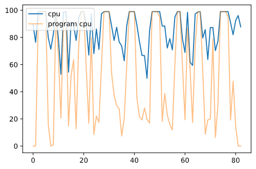
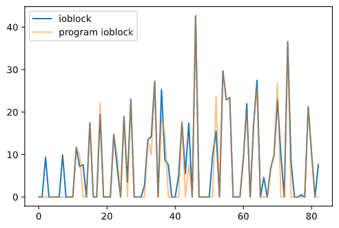

# Лабораторная работа №1

Разработать программу на языке С, которая осуществляет следующие действия:
- Создает область памяти размером A&nbsp;=&nbsp;178&nbsp;мегабайт, начинающихся с адреса B&nbsp;=&nbsp;`0xDF22D146` (если возможно) при помощи C&nbsp;=&nbsp;`malloc`, заполненную случайными числами `/dev/urandom` в D&nbsp;=&nbsp;32&nbsp;потока. Используя системные средства мониторинга определите адрес начала в адресном пространстве процесса и характеристики выделенных участков памяти. Замеры виртуальной/физической памяти необходимо снять:
    - До аллокации
    - После аллокации
    - После заполнения участка данными
    - После деаллокации
- Записывает область памяти в файлы одинакового размера E&nbsp;=&nbsp;83 мегабайт с использованием F&nbsp;=&nbsp;блочного обращения к диску. Размер блока ввода-вывода G&nbsp;=&nbsp;61 байт. Преподаватель выдает в качестве задания последовательность записи/чтения блоков H&nbsp;=&nbsp;последовательный
- Генерацию данных и запись осуществлять в бесконечном цикле.
- В отдельных I&nbsp;=&nbsp;37 потоках осуществлять чтение данных из файлов и подсчитывать агрегированные характеристики данных &mdash; J&nbsp;=&nbsp;сумму.
- Чтение и запись данных в/из файла должна быть защищена примитивами синхронизации K&nbsp;=&nbsp;`futex`.
- По заданию преподавателя изменить приоритеты потоков и описать изменения в характеристиках программы.

Для запуска программы возможно использовать операционную систему Windows 10 или  Debian/Ubuntu в виртуальном окружении.

Измерить значения затраченного процессорного времени на выполнение программы и на операции ввода-вывода используя системные утилиты.

Отследить трассу системных вызовов.

Используя stap построить графики системных характеристик.

## Вариант:

| Переменная | Значение |
|-|-:|
| A | `178` |
| B | `0xDF22D146` |
| C | `malloc` |
| D | `32` |
| E | `83` |
| F | `block` |
| G | `61` |
| H | `seq` |
| I | `37` |
| J | `sum` |
| K | `fute` |

<!-- `A=178;`
`B=0xDF22D146;`
`C=malloc;`
`D=32;`
`E=83;`
`F=block;`
`G=61;`
`H=seq;`
`I=37;`
`J=sum;`
`K=futex` -->

## Решение:
| Что | Где |
|-|-|
| Разработанная программа | [`program/lab1.c`](./program/lab1.c) |
| Скрипт `stap` | [`scripts/lab1.stp`](./scripts/lab1.stp) |
| Скрипт для запуска `pmap` | [`scripts/run_pmap.sh`](./scripts/run_pmap.sh) |
| Скрипт для запуска `strace` | [`scripts/run_strace.sh`](./scripts/run_strace.sh) |
| Вывод `stap` | [`reports/stap.txt`](./reports/stap.txt) |
| Вывод `pmap` до выделения памяти | [`reports/pmap1.txt`](./reports/pmap1.txt) |
| Вывод `pmap` после выделения памяти | [`reports/pmap2.txt`](./reports/pmap2.txt) |
| Вывод `pmap` после заполнения памяти | [`reports/pmap3.txt`](./reports/pmap3.txt) |
| Вывод `pmap` после освобождения памяти | [`reports/pmap4.txt`](./reports/pmap4.txt) |
| Вывод `strace` | [`reports/strace.txt`](./reports/strace.txt) |

В выводе `strace` можно заметить кластеры вызовов `munmap` &mdash; это освобождение памяти после чтения из файла.

Из вывода `pmap` можно понять, страница для выделенной памяти
расположена по адресу `00007f5586792000` и имеет размер
`182288` килобайт.

Занимаемая программой память
| Когда | Виртуальная | Физическая |
|-|-:|-:|
| До выделения памяти | 2.6 МБ | 84.0 КБ |
| После выделения памяти | 180.6 МБ | 84.0 КБ |
| После заполнения памяти | 212.6 МБ | 178.1 МБ |
| После освобождения памяти | 34.6 МБ | 148.0 КБ |
(см. скриншоты в [`reports`](./reports))

График потребления ресурсов

График использования ЦПУ системой и программой

(горизонтальная ось &mdash; секунды с момента запуска `stap`,
вертикальная &mdash; проценты)

График использования ввода-вывода системой и программой

(горизонтальная ось &mdash; секунды с момента запуска `stap`,
вертикальная &mdash; проценты)

## Вывод:
В данной лабораторной работе я решал задачу мониторинга исполняемой программы и ее потребления ресурсов.
Для этого я использовал системные утилиты Linux:
- `strace` &mdash; утилита для трассировки системных вызовов,
- `pmap` &mdash; утилита для снятия карты памяти процесса,
- `stap` &mdash; многоцелевая утилита для внедрения кода в ядро и мониторинга,
- а также системный монитор рабочего окружения Gnome &mdash; для замеров системных характеристик и получения графиков. Последний можно легко заменить другими утилитами, как например `htop`.

## Ответы на вопросы:
1. Почему компилятор не делает все переменные `atomic`?
**Ответ:** атомарны не переменные, а операции с ними.
При этом эти операции должны проходить в обход кеша и регистров,
в противном случае атомарная операция должна заблокировать участок памяти для
всех остальных ядер процессора.
Такое поведение сильно снижает производительность.
